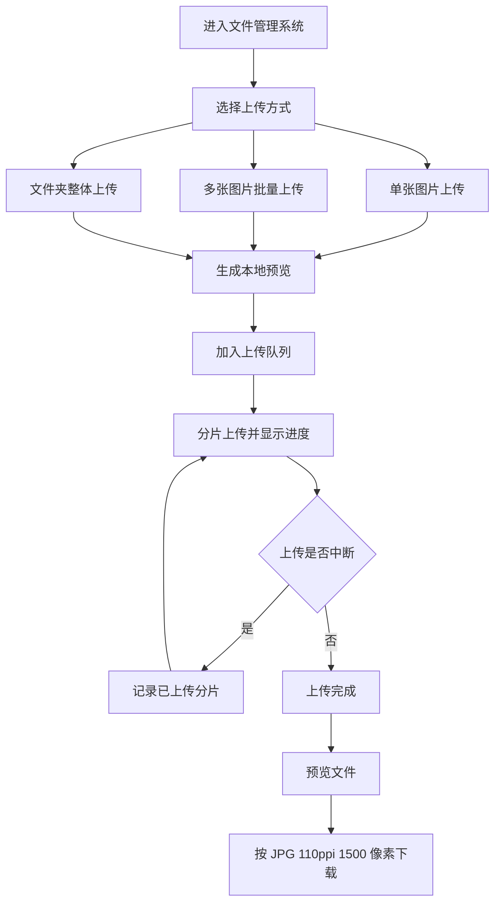

## 1. 产品概述
网页版文件管理系统用于完成图片上传、预览、断点续传、进度追踪与下载管理，面向需要在浏览器中快速整理和传输图片文件的用户。
- 解决单图、多图、整文件夹上传流程分散、预览不直观、传输中断后需重传的问题。
- 提供现代化、响应式、跨浏览器兼容的文件操作体验，并支持按 JPG、110ppi、1500 像素规格输出下载。

## 2. 核心功能

### 2.1 功能模块
1. **文件管理首页**：顶部状态栏、上传入口、文件列表、预览面板、下载操作。
2. **上传工作台**：单张图片上传、多张图片批量上传、文件夹整体上传、拖拽上传、断点续传、上传进度显示。
3. **预览与导出面板**：上传前预览、上传后预览、图片信息展示、JPG 110ppi 1500 像素输出、单文件下载与批量下载。

### 2.2 页面详情
| 页面名称 | 模块名称 | 功能描述 |
|-----------|-------------|-------------|
| 文件管理首页 | 顶部状态栏 | 展示总文件数、上传中数量、完成数量、失败数量与存储占用估算 |
| 文件管理首页 | 上传入口 | 支持点击选择、拖拽上传、单图、多图、文件夹三种入口 |
| 文件管理首页 | 文件列表 | 展示缩略图、文件名、大小、类型、上传状态、进度、操作按钮 |
| 文件管理首页 | 预览面板 | 支持上传前和上传后查看图片内容、尺寸、文件大小与导出规格 |
| 文件管理首页 | 下载面板 | 支持下载单个处理后 JPG、下载原图、批量打包下载 |
| 上传工作台 | 断点续传 | 文件分片上传，失败后可从已完成分片继续上传 |
| 上传工作台 | 进度显示 | 文件级进度、总进度、上传速度与状态提示 |
| 预览与导出面板 | 输出规格 | 默认输出 JPG、宽度 1500 像素、高度按比例自适应，96 DPI，保持视觉质量 |

## 3. 核心流程
用户进入系统后，可通过拖拽、文件选择或文件夹选择添加图片；系统立即生成本地预览并展示待上传队列；用户点击上传后，系统按分片方式传输并显示进度；上传完成后可在文件列表中查看、预览和下载文件；若上传中断，可继续从断点恢复。

## 4. 用户界面设计

### 4.1 设计风格
- 主色：墨蓝黑 `#0B1020`，强调色：荧光青 `#39E6D2`，辅助色：琥珀橙 `#F6B44B`。
- 风格方向：精密仪表盘式文件中枢，强调专业、清晰、可控。
- 按钮：中等圆角、细描边、轻玻璃质感，主操作按钮高对比发光。
- 字体：标题使用具有技术感的展示字体，正文使用清晰易读的现代无衬线字体。
- 布局：桌面端三栏结构，左侧上传区，中间队列列表，右侧预览与导出；移动端折叠为单列卡片流。
- 动效：文件拖入时边框脉冲、上传进度平滑推进、完成状态有短暂高亮反馈。

### 4.2 页面设计概览
| 页面名称 | 模块名称 | UI 元素 |
|-----------|-------------|-------------|
| 文件管理首页 | 上传区 | 大面积拖拽面板、三种上传按钮、格式说明、浏览器兼容提示 |
| 文件管理首页 | 队列区 | 紧凑表格/卡片、缩略图、进度条、状态标签、重试/暂停/下载按钮 |
| 文件管理首页 | 预览区 | 大图预览、元信息、导出规格、下载按钮、批量下载入口 |
| 文件管理首页 | 响应式布局 | 桌面三栏、平板双栏、手机单列，操作按钮保持触控友好 |

### 4.3 响应式与兼容性
- 桌面优先设计，兼容 Chrome、Firefox、Safari、Edge 的现代版本。
- 使用标准 File API、Directory Upload 能力和分片上传逻辑；文件夹上传在支持 `webkitdirectory` 的浏览器启用。
- 移动端隐藏文件夹上传入口，保留单图与多图上传。
- 关键交互提供键盘可访问性和清晰焦点状态。

### 4.4 输出规格
- 下载图片默认为 JPG。
- 导出元数据设置为 96 DPI。
- 输出宽度目标为 1500 像素，高度按原图比例自适应。
- 若源图小于目标尺寸，默认不强制放大，避免画质劣化。