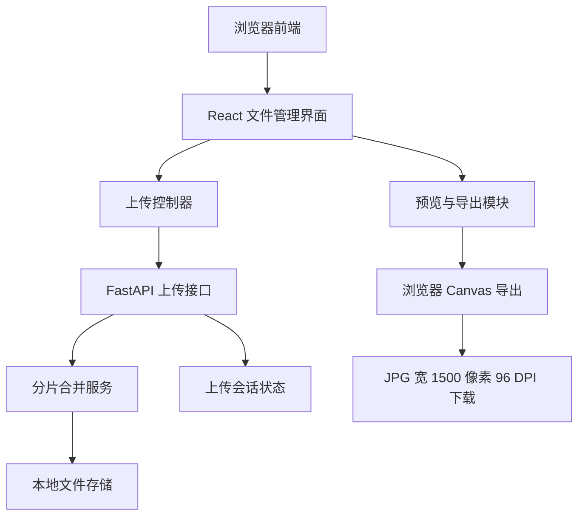
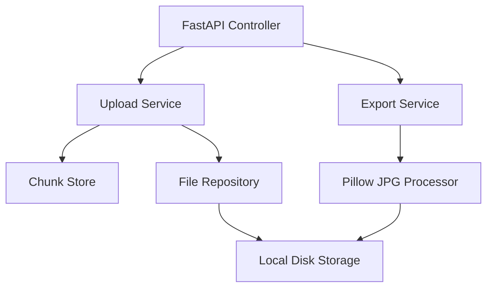
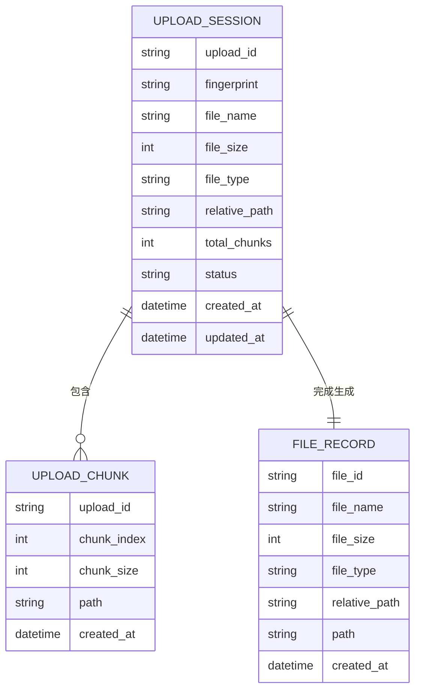

## 1. 架构设计



系统采用前后端分离但同仓库部署的架构：前端负责文件选择、预览、分片、进度展示与 JPG 导出；后端负责接收分片、记录上传会话、合并文件与提供下载接口。优先减少外部服务依赖，默认使用本地磁盘存储。

## 2. 技术描述
- 前端：React@18 + TypeScript + Vite + Tailwind CSS@3。
- 后端：沿用现有 FastAPI 服务，新增上传、分片、文件列表与下载接口。
- 图片预览：浏览器 File API + Object URL。
- JPG 导出：Canvas 或后端 Pillow 将图片缩放到宽度 1500 像素，高度按比例自适应，导出 JPEG；96 DPI 由后端补写元数据。
- 断点续传：文件按固定大小切片，使用文件指纹、分片索引和上传会话记录已完成分片。
- 存储：本地 `uploads/` 目录保存原始文件、分片临时文件和合并结果。
- 兼容性：Chrome、Firefox、Safari、Edge；文件夹上传在 Chromium/Safari 系浏览器使用 `webkitdirectory`，Firefox 提供多选上传替代。

## 3. 路由定义
| 路由 | 用途 |
|------|------|
| `/` | 文件管理首页，包含上传、队列、预览、下载 |

## 4. API 定义

```typescript
type UploadSessionRequest = {
  fileName: string;
  fileSize: number;
  fileType: string;
  relativePath?: string;
  fingerprint: string;
  totalChunks: number;
};

type UploadSessionResponse = {
  uploadId: string;
  uploadedChunks: number[];
};

type ChunkUploadRequest = FormData; // uploadId, chunkIndex, chunk, fingerprint

type ChunkUploadResponse = {
  uploadId: string;
  chunkIndex: number;
  completed: boolean;
  progress: number;
};

type FileItem = {
  id: string;
  fileName: string;
  fileSize: number;
  fileType: string;
  relativePath?: string;
  url: string;
  createdAt: string;
};
```

| 方法 | 路径 | 用途 |
|------|------|------|
| `POST` | `/api/uploads/session` | 创建或恢复上传会话，返回已上传分片 |
| `POST` | `/api/uploads/chunk` | 上传单个分片 |
| `POST` | `/api/uploads/complete` | 校验并合并分片 |
| `GET` | `/api/files` | 获取已上传文件列表 |
| `GET` | `/api/files/{file_id}` | 下载原始文件 |
| `GET` | `/api/files/{file_id}/jpg` | 下载处理后的 JPG 110ppi 1500 像素文件 |
| `DELETE` | `/api/files/{file_id}` | 删除文件 |

## 5. 服务端架构图



## 6. 数据模型

### 6.1 数据模型定义



### 6.2 数据定义
默认不引入数据库，使用文件系统元数据 JSON 存储，降低部署复杂度：

```json
{
  "sessions": {},
  "files": []
}
```

若后续需要多用户、权限或大规模检索，可迁移到 SQLite，表结构与上述数据模型保持一致。

## 7. 开发边界
- 本阶段实现单用户文件管理，不包含登录、权限隔离和云存储。
- 文件夹上传保留相对路径展示，但下载时默认按文件逐个下载；批量打包可作为增强功能。
- 断点续传以同一浏览器、同一文件指纹为恢复依据。
- 输出 JPG 的宽度 1500 像素、高度自适应和 96 DPI 元数据由后端 Pillow 保证。